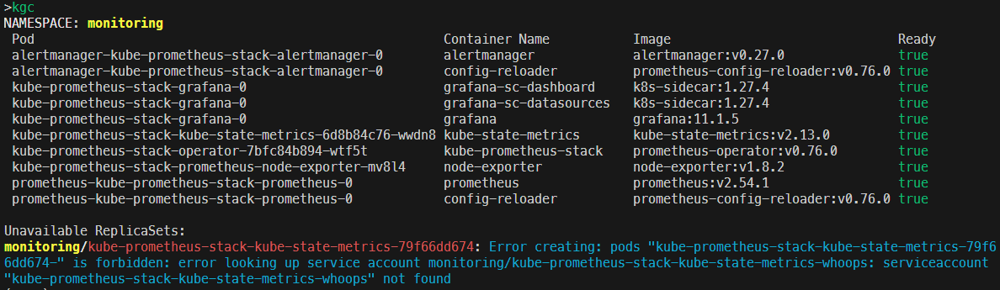

# kgc: kubectl get containers

The name `kgc` is because it is like the alias `kgp` for `kubectl get pods`

`kgc` is to `k get containers` (if you don't alias k to kubectl, you should)

It also prints related errors to help fix.



## TODO

1. Python pip3 installation (WIP [README-python.md](README-python.md))
2. Inform user how to fix more issues:
    1. PV in zone with no nodes
3. krew plugin

## Requirements

1. jq version 1.6 does not work. jq-1.7.1 does work
2. bash and zsh have been tested and should both work. 

Please file an issue with the detials if you find anything. Also happy to accept pull requests

## Usage

This is a function. Use it by sourcing it in your shell:
```sh
source .kgc.sh
```

Then run it:

`kgc [namespace]`

`kgc all` will run it against all namespaces.

## Installation

>You should always read and understand a script before running it. This is a good practice to avoid running malicious code.

Copy and paste from here: [kgc shell script](kgc.sh)

Or simply:

```sh
wget -O ~/kgc.sh https://raw.githubusercontent.com/jessegoodier/kgc/main/kgc.sh
echo "alias kgc=~/kgc.sh" >> ~/.zshrc
echo "alias kgc=~/kgc.sh" >> ~/.bashrc
```

## Example commands

```sh
Usage: kgc [namespace] OR [arguments]...
Examples:
kgc -n kube-system - will get all pods in the kube-system namespace
kgc with no arguments will get all containers in the current context namespace
Available arguments:
  -a or -A       Get containers in all namespaces
  -n namespace   Specific namespace
  -p             Hide pod error list
  -r             Hide replicaset error list
  -h or --help   Display this help and exit
```
